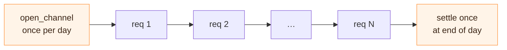

# Metered APIs

APIs that bill per-call but charge for variable amounts of work per
call sit awkwardly in today's pricing models. Search APIs, geospatial
queries, database services, on-chain indexers — all of them currently
approximate variable cost with tiered pricing or flat rates because
true per-unit-of-work pricing has no settlement rail that could
amortize across millions of small calls.

TAP fits this gap.

## The shape

| Today | With TAP |
| --- | --- |
| Tiered plans ("up to 1,000 results / call") | Per-result pricing, halt at any boundary |
| Pre-paid credits or monthly invoice | Channel reuse: open once, settle at threshold |
| Dispute = email customer support | Dispute = on-chain commitment chain |

The session model is the LLM model, narrowed to APIs where work is
chunked:

```python
async for result in session.stream({"query": "..."}):
    # each result is one chunk; cumulative_paid ticks up
    if good_enough(accumulated):
        break  # consumer halts; commit chain reflects exactly what was billed
```

## Concrete fits

* **Search APIs** that traverse an index — pay per result-document
  inspected. Halt when the result set is "good enough", or when the
  query budget is exhausted.
* **Geospatial APIs** with variable computation depth (route planning
  with optional traffic data, isochrone calculations) — pay per stage
  of computation completed; halt when the answer is precise enough.
* **DB / KV proxies** that bill per-row scanned — pay per page
  returned; halt when filters narrow to expected size.
* **On-chain indexers** streaming back historical events — halt when
  the consumer has enough events to satisfy their query.

## Channel reuse is the headline benefit

For metered APIs the per-session overhead matters more than for LLM
inference, because individual calls are smaller. The cross-request
channel reuse pattern (whitepaper §4.7) is what makes this economical:



A consumer doing 10,000 lookups per day against the same provider pays
for *one* `open_channel` and *one* `settle` transaction in fees,
amortizing the on-chain cost across all 10,000 requests. The
per-request marginal overhead is a single Ed25519 signature.

## Anti-pattern

Don't use TAP for fixed-price one-shot calls — that's exactly the
case x402's standard `payRequired` flow handles, and adding a channel
makes it more expensive, not less. The right rule: TAP for variable-
cost streaming work, x402 fixed-price for one-shot calls. They
compose; pick the right one per endpoint.
