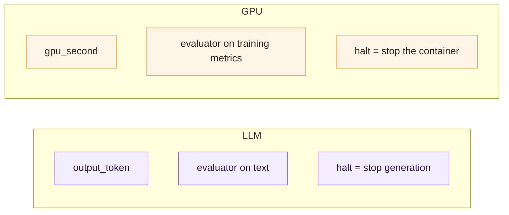

# Cloud compute & GPU rental

Per-second compute pricing for training jobs, batch inference at scale,
rendering, and decentralized GPU networks is currently bundled into
hourly or longer billing increments. TAP's primitives support genuine
per-second metering with the producer–consumer pattern intact.

## What maps directly

* The unit shifts from "output token" to "GPU-second" (or, more
  granularly, `(gpu_type × second)` for fleets with mixed hardware).
* The session shape is unchanged: open with a deposit, stream
  per-second commitments, halt and settle at any second boundary.
* Halt triggers come from the consumer's *job* (training loss
  diverges; container OOMs; output checksum fails) or from the
  producer (consumer stops signing).

## What's different



Two real differences:

* **Quality is an out-of-band signal.** The consumer's training script
  reports loss / step time / gradient norms — these are the inputs to
  the halt decision, not the GPU output itself. Wire the evaluator to
  consume metrics from the job's existing telemetry stream rather than
  the compute output.
* **Halt has real teardown cost.** Stopping a training run mid-epoch
  loses progress unless the job checkpoints. Consumers should evaluate
  more conservatively than they would for LLM streams — the cost of
  re-running compute is non-zero, even if TAP recovers the funds.

## Where this is useful

* **Spot compute markets.** Decentralized GPU networks (Akash, Render,
  io.net analogues) need fair per-second settlement without a
  centralized billing service. TAP is the rail.
* **Batch inference fleets.** Running 10,000 inference jobs across
  shared infrastructure with per-customer accounting becomes one
  channel per (customer, infrastructure-shard) pair, settled at
  shift-end.
* **Render farms.** Per-frame pricing with cumulative-paid commitments
  per frame; halt when a render fails QC. Same shape as LLM token
  streaming; different unit.

## A concrete client snippet

```python
async def gpu_session():
    async with TapConsumer(...) as consumer:
        session = await consumer.open_session(
            producer_url="https://gpu.example.com/v1/run",
            deposit_micro=1_000_000,             # $1.00 per session
            prompt_body={
                "image": "training-image:v3",
                "command": ["python", "train.py"],
                "gpu_type": "h100-80gb",
            },
            evaluator=compose(
                gradient_norm_guard(threshold=10.0),
                step_time_guard(p99_ms=2_000),
                explicit_user_stop(channel="ctrl-c"),
            ),
        )
        async for second in session.stream(...):
            telemetry.record(second)
```

The evaluator API doesn't change at all — only what it inspects.

## When TAP is the wrong tool

* **Long-running jobs with very few halt signals.** A 6-hour training
  run that the consumer is committed to seeing through doesn't benefit
  from per-second commitments — the bilateral halt provides no value
  if neither side will exercise it. Standard pre-paid hourly billing
  is fine.
* **Single-tenant infra where reputation already exists.** The trust
  reduction TAP provides is a structural improvement when consumer
  and producer don't share an account system. In a closed shop,
  hourly invoicing already works.
