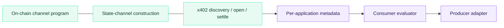

# Beyond LLM inference

LLM inference is the workload most acutely in need of fair, fine-grained
payment — but TAP's primitives generalize. The same channel
construction, the same bilateral halt, the same x402 bootstrap apply
wherever value is delivered as a continuous flow and the consumer
benefits from being able to halt mid-flow.

This section sketches each adjacent application: what changes, what
doesn't, and where the protocol's shape *requires rethinking* before it
maps cleanly to a new domain. We treat these not as commitments but as
an honest read on adjacency — what the substrate actually supports.

## What's the same across applications

The on-chain program, the channel state machine, and the x402
bootstrap are unchanged. What varies is the per-application
metadata published at session open (what the unit is, what the
price is, what halt signals make sense), the evaluator (what
indicates quality issues for *this* content type), and the producer
wrapper that adapts the protocol to the underlying service's
streaming format.

## Index

| Application | Unit | Halt example | Page |
| --- | --- | --- | --- |
| Video streaming | per-second | viewer pauses; quality drops | [Video](/beyond-llm/video) |
| Audio (TTS, music) | per-second | encoder error; off-topic spoken response | [Audio](/beyond-llm/audio) |
| Cloud compute & GPU rental | per-second | training diverges; container OOMs | [GPU rental](/beyond-llm/gpu) |
| Metered APIs (search, geospatial, DB) | per-unit-of-work | result-set limit reached | [Metered APIs](/beyond-llm/apis) |

## Where the substrate stops being a fit

Three honest cuts:

* **Atomic deliveries.** Generated images, complete audio files, compiled
  artifacts have no value as a partial. Streaming + halt does nothing for
  them. The whitepaper proposes hash-locked atomic exchange as a v2
  extension; that's a different cryptographic recipe on the same channel.
* **Sub-cent per-session aggregate spend.** TAP's two-tx amortization (open
  + settle) costs around $0.004 in fees. Below ~$0.005 of session spend,
  direct one-shot x402 payment is more efficient. Channel reuse fixes
  this for high-volume consumers; for one-shot tiny payments, TAP is the
  wrong tool.
* **Privacy-sensitive workloads.** Channel openings link consumer and
  producer pubkeys on-chain. Medical inference, legal queries, and other
  privacy-load-bearing flows need application-layer privacy
  (stealth addresses, blinded routing) that v1 doesn't provide.
