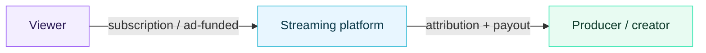
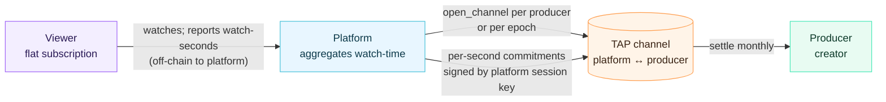
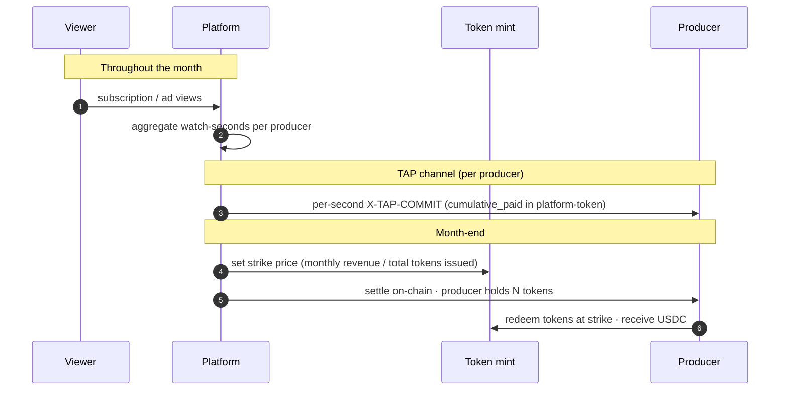

# Video streaming

Video is a natural fit for streaming-payment primitives — viewers
abandon early, content quality varies, and the unit of value (a
second of watched video) is naturally continuous. But it's also where
"show users a per-token meter" stops working as a UX, and where prior
attempts at micropayment-per-content have piled up failure modes worth
learning from.

This page is the longest in the Beyond-LLM section because the
*correct* mapping is not a 1:1 port of the LLM session. The honest
answer is: TAP's mechanics belong on the **producer-platform** edge,
not the **viewer-platform** edge.

## The shape of the problem

A streaming video session has three actors, not two:

Three properties make the consumer-facing rail different from LLM
inference:

1. **Viewers are not running agents.** They cannot reasonably be asked
   to sign a fresh Ed25519 commitment every K seconds. Even with a
   session key, a per-second commit cadence in a battery-constrained
   mobile player is wrong.
2. **The "halt" signal already exists** — pressing Pause, closing the
   tab, switching apps. These are UI-native and deterministic;
   surfacing them as cryptographic events buys nothing.
3. **Showing the meter to the viewer breaks the product.** Watch-time
   is anxiety-sensitive. A ticker that says "$0.00027 watched" in real
   time degrades the experience and shifts attention away from the
   content. Decades of UX testing in subscription video has converged
   on flat-fee abstraction for a reason.

So a literal port — viewer signs a commit per second, halts when they
pause, settles on close — works *technically* but produces a worse
product than what already exists.

## What people have tried

The history of micropayments-for-content is mostly a graveyard:

| Era | Attempt | What broke |
| --- | --- | --- |
| 2014–2017 | Browser-mounted USD micropayments (Flattr, Blendle) | Friction; users would not authorize sub-cent payments per article. Conversion rates < 1%. |
| 2017–2020 | Brave + BAT | Tipping wallet abstracted micropayments to monthly buckets, but creator-side denomination in a volatile token deterred opt-in. |
| 2018–2022 | Lightning paywalls (Sphinx, Fountain podcasts) | Worked for a niche audience comfortable with non-custodial wallets. Mainstream users could not bridge fiat → channel without mediation. |
| 2020–2024 | NFT-gated streaming (Audius, several music DAOs) | Discovery and curation problems remained, but the rail itself functioned. Sub-cent metering was *not* the bottleneck — distribution was. |

The common thread: **users don't want to make purchase decisions at
content-unit granularity.** Even if the cost is real and small, the
cognitive overhead of evaluating "is this next minute worth it" is
larger than the price being saved. Subscriptions and ad models exist
because they remove that decision.

## The decentralized cashier

The right place for TAP's primitives in video is between the platform
and the producer, not between the viewer and the platform.

The platform plays the consumer role from TAP's perspective. It opens
a channel against each producer (or one channel per producer per
billing epoch), signs per-second commitments as watch-time accumulates,
and settles on-chain at month-end. The viewer never sees a meter; the
viewer pays a flat subscription or watches ads. The protocol's job is
to ensure the platform's *attribution math* is auditable and
non-repudiable to producers.

### Why this works

* **Halt is platform-side.** If a producer goes offline, uploads
  copyright-flagged content, or otherwise stops being eligible for
  payout, the platform stops signing. The producer's exposure is
  bounded by the trailing buffer (a few minutes of unsettled watch-time).
* **Producers can verify the math.** Every commitment carries
  `cumulative_paid` plus a tokens-equivalent count (watch-seconds, in
  this mapping). A producer running a thin client can replay the
  commitment chain and confirm the platform paid them for exactly the
  hours their content was watched, no more, no less.
* **Tokenized cashout.** The on-chain settlement asset doesn't have to
  be USDC. It can be a platform-issued SPL token whose redemption value
  is set monthly based on platform revenue (subscription + ad
  receipts). Producers receive tokens as commitments accrue and redeem
  them at month-end against the period's strike price.
* **Disputes have a real path.** A producer who believes the platform
  under-counted their watch-time has on-chain evidence of every signed
  commitment and can present a counter-aggregate. The protocol's
  bilateral-halt and dispute-window machinery already supports this.

### What the token-with-monthly-strike does

A platform-issued token with a strike price that floats with revenue
solves two real problems at once:

1. **Producers prefer fiat-equivalent stability.** Settling in
   platform-token rather than directly in USDC lets the platform
   absorb the economic risk of revenue volatility — payout is
   denominated in the medium it's earned in.
2. **Producers benefit if the platform grows.** A producer holding
   tokens has direct upside when the platform's monthly revenue
   increases, without needing equity instruments. This aligns
   incentives in a way that flat-rate revenue share does not.

The cashout flow:

### Trade-offs

* **The platform becomes a trusted aggregator.** Producers must trust
  that watch-time is reported honestly. TAP doesn't fix this — it's an
  application-layer concern (audit logs, third-party measurement,
  reputation systems). What TAP *does* fix is the leg from honest
  watch-time to non-repudiable payment.
* **Token redemption has tax implications** that vary by jurisdiction.
  Direct USDC settlement may be simpler for compliance even if it
  leaves revenue-volatility risk on producers.
* **Non-custodial producer wallets need bridging.** Producers paying
  out to bank accounts need an off-ramp, the same way creators on any
  Solana-native rail do today.

## What TAP itself contributes

The protocol's contribution is *not* a new economic model for video —
those exist and are functioning. It's a settlement rail that:

* **Removes the manual reconciliation step** between the platform's
  attribution database and the creator payout pipeline. Both sides see
  the same on-chain history; neither can rewrite it.
* **Makes producer onboarding sub-second.** A creator opens a wallet,
  the platform opens a channel against it, watch-time starts
  accruing — no MSA, no W-9 round-trip for the rail itself.
* **Bounds platform-side risk.** A misbehaving creator (one whose
  content the platform decides to remove mid-month) is bounded by the
  trailing-buffer: at most a few minutes of unsettled watch-time, not
  a full month.

## When this is the wrong tool

* **Pure user-pays models** (no flat subscription, viewer literally pays
  per second) — see the UX argument above. TAP can do it, but the
  product is worse than the alternatives. Don't build this.
* **Single-payload video deliveries** (download a 4K file once) — the
  hash-locked atomic exchange that whitepaper §10.1 proposes is the
  right primitive, not streaming commitments.
* **Live broadcast at scale where every viewer is a separate
  consumer** — the open-tx-per-viewer cost is too high. The platform
  aggregator pattern above is the answer here too.

## Summary

* Don't put the meter in front of the viewer.
* Do put TAP between the platform and the producer.
* Settle in a platform-issued token whose strike price is a function of
  monthly revenue, not in USDC directly.
* Use TAP's bilateral halt for content-takedown and producer-offline
  cases — these are real, and they happen mid-stream.
* Use the dispute window for attribution disagreements — a producer's
  on-chain commitment chain is the receipts.
