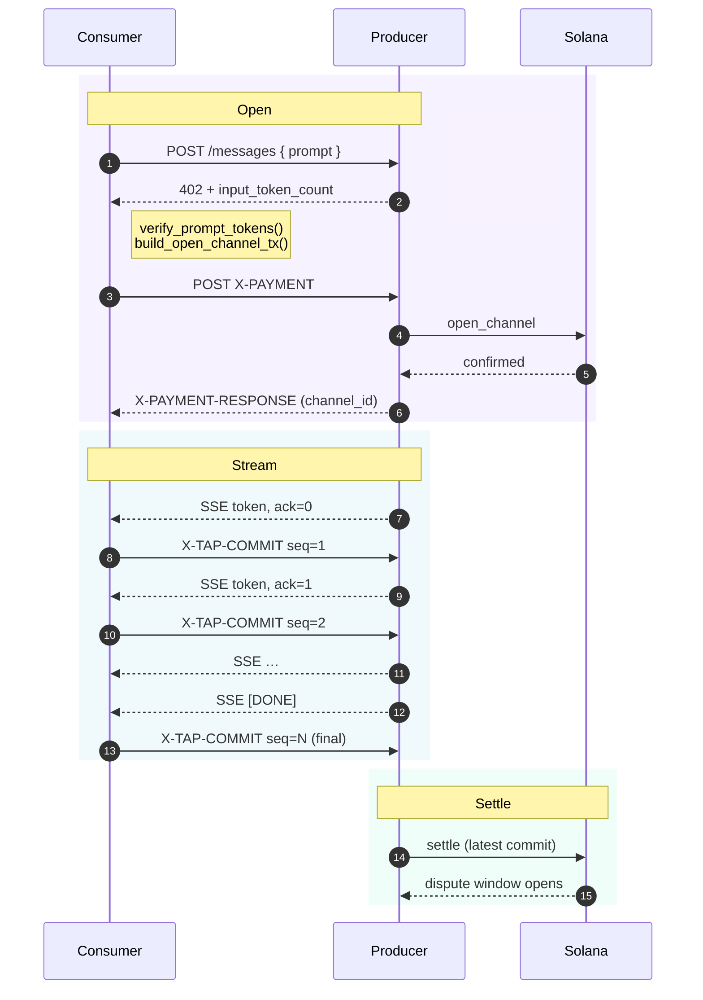

# Session lifecycle

A TAP session has three phases: **open**, **stream**, **settle**.

## Open

The consumer **POSTs the prompt to the producer's URL with no payment**. The
producer:

1. Tokenizes the prompt with its declared `tokenizer_id`.
2. Returns HTTP 402 with `X-PAYMENT-REQUIREMENTS` carrying:
   - `input_price_micro` and `output_price_micro` (per-token, asymmetric)
   - `tokenizer_id` (so the consumer can re-tokenize locally)
   - `input_token_count` and `prepaid_input_micro = input_token_count × input_price_micro`
   - `max_unpaid`, `trailing_buffer`, `duration`, `dispute_secs`, `grace_ms`, `pause_timeout_ms`

The consumer then:

1. Re-tokenizes the prompt locally with the same `tokenizer_id`. If the
   count disagrees with the producer's `input_token_count`, **abort** —
   tokenizers are deterministic, so any mismatch implies misbehaviour
   ([§5.3.7](/protocol/trust-model)).
2. Builds an `open_channel` Solana transaction depositing
   `deposit_micro` USDC into the channel PDA, locking
   `prepaid_input_micro` on-chain as the **settlement floor**.
3. POSTs that transaction to the producer with `X-PAYMENT`.
4. Receives `X-PAYMENT-RESPONSE` with the channel ID once the
   transaction confirms.

## Stream

The producer runs prefill and starts emitting output tokens via SSE.
Each token is one `data:` event. As tokens flow:

- The consumer accumulates output, runs the configured evaluator after
  each chunk, and signs an incrementing `CommitMessage` every K tokens.
  Each commit's `cumulative_paid = prepaid_input + (output tokens × output_price)`.
- The producer holds the latest accepted commit. K is auto-tuned by the
  consumer SDK (AIMD, like TCP congestion control).

## Settle

When the stream ends — gracefully or via halt — the producer submits the
latest commit to the on-chain `settle` instruction. The program:

1. Verifies the Ed25519 signature against the channel's session key
   (via the Ed25519Program sibling instruction).
2. Enforces `prepaid_input ≤ cumulative_paid ≤ deposit`.
3. Records the latest accepted state and opens the dispute window.

After the dispute window (configurable, default 30s) elapses, either
party calls `close`, which actually moves USDC: `cumulative_paid` to
the producer, the rest back to the consumer. **One on-chain
transaction per session** (or per N sessions in a reused channel —
see [Channel reuse](/protocol/on-chain#channel-reuse)).
