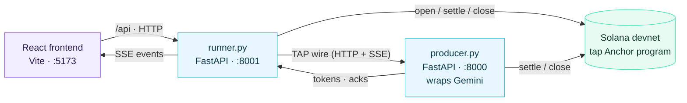

# Demo architecture

The reference demo is four processes:



## Why a runner backend?

The TAP consumer SDK is in Python: it owns the session-key signer,
the Solana RPC client, the x402 wire codecs, and the streaming state
machine. Reimplementing that in TypeScript for the demo would mean
keeping two consumers in sync. Instead the browser drives a small
backend (`runner.py`) that wraps `TapConsumer` and pushes session
events as SSE.

The runner exposes three endpoints:

| Method | Path | Description |
| --- | --- | --- |
| `GET` | `/api/config` | Static info (network, addresses) |
| `GET` | `/api/balances` | Live consumer + producer USDC balances |
| `POST` | `/api/run` | Accepts a prompt; streams session events as SSE |

## Frontend layout

| Component | Responsibility |
| --- | --- |
| `App.tsx` | Two-column layout, owns the session hook + config fetch |
| `Header.tsx` | Network/program/asset display |
| `PromptForm.tsx` | Prompt input + deposit knob + "Enforce JSON schema" toggle |
| `OutputPanel.tsx` | Streamed text, halt banner |
| `MeterPanel.tsx` | Tokens, paid USDC, prepaid input, output spend, refundable, commits |
| `TimelinePanel.tsx` | Channel-open + per-commit timeline |
| `BalancePanel.tsx` | Consumer + producer USDC balances, refresh on session close |

State flows through one hook (`useTapSession`) that:

- Subscribes to the runner's SSE.
- Maintains a `SessionState` reducer matching event types (`phase`,
  `session_open`, `token`, `commit_signed`, `complete`, `error`).
- Exposes `start(prompt, deposit, enforceSchema)` and `reset()`.

## Adding your own model

Drop a new adapter into `sdk/python/tap/adapters/` that takes a
request body and returns an `AsyncIterator[str]`. Then in
`demo/producer.py`:

```python
from tap.adapters.my_model import stream_my_model

producer = TapProducer(..., model_name="my-model-v1")

@producer.handler("/v1/messages")
async def handle(body: dict):
    return stream_my_model(body)
```

Update the `tokenizer_id` in `Pricing` if your model uses a different
tokenization than `tap.tok.v1`, and register it with
`tap.tokenizer.register(...)` before constructing the producer.
