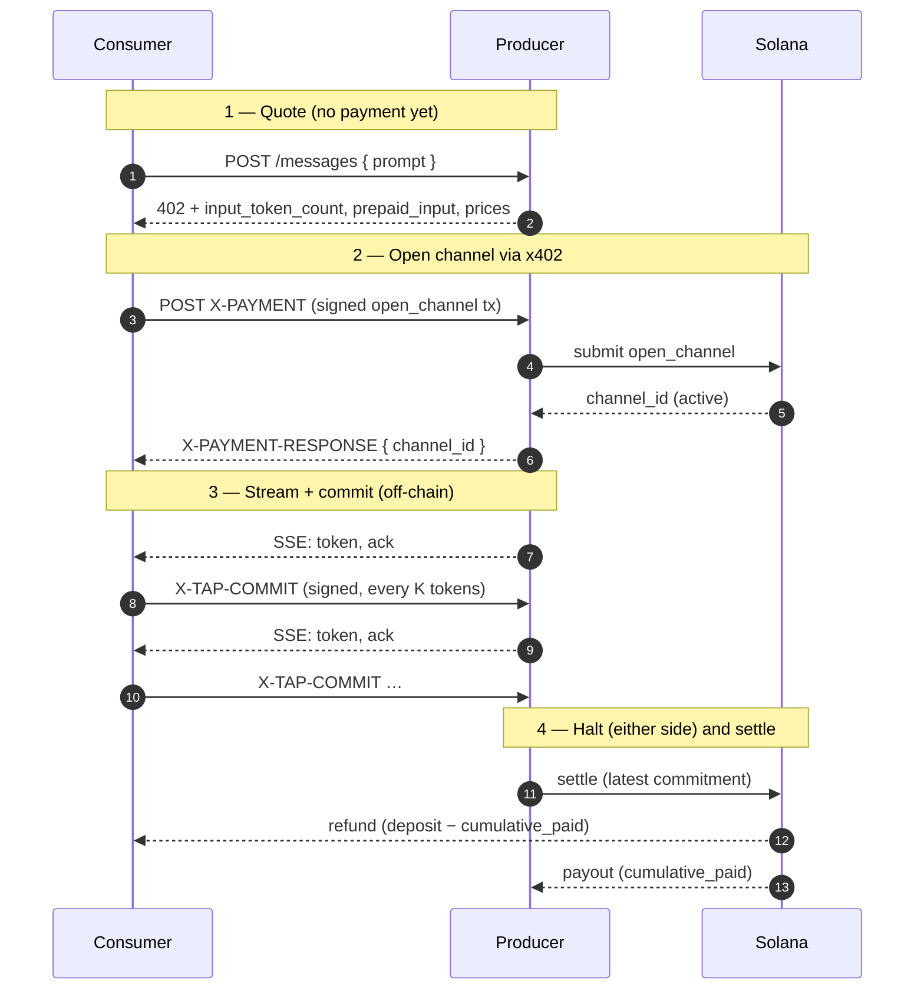

# TAP — Token Access Protocol

TAP is a payment protocol for LLM inference. The consumer pays the producer
**one token at a time** through a Solana state channel, and **either side can
halt at any output-token boundary**. Settlement only ever moves USDC for
output the consumer actually accepted.

## What's in these docs

* [Concepts](/concepts/why-tap) — why per-response payment is broken, what TAP
  does about it, and how the protocol fits with x402.
* [Protocol](/protocol/on-chain) — on-chain instructions, wire format, trust
  guarantees and adversarial scenarios.
* [SDK](/sdk/install) — installing the Python SDK and writing your own
  producer / consumer.
* [Demo](/demo/run) — running the reference Gemini-backed producer with the
  React dashboard against Solana devnet.
* [Whitepaper](/whitepaper) — the full protocol specification (PDF).

## At a glance

| | Pay-after-delivery API | TAP |
| --- | --- | --- |
| Consumer trusts producer for | Full request value, every request | One commitment batch (sub-cent) |
| Producer trusts consumer for | Nothing (pre-funded accounts) | One commitment batch (sub-cent) |
| Halt mid-response | No | Yes, any output-token boundary |
| Refund unused tokens | No | Yes, on-chain |
| Input cost | Paid as part of the response | Locked at channel open as `prepaid_input` |
| Settlement | Off-chain billing | One Solana transaction |

## Status

Reference implementation deployed to Solana devnet. Not audited. Hackathon
project (Solana Frontier 2026).
